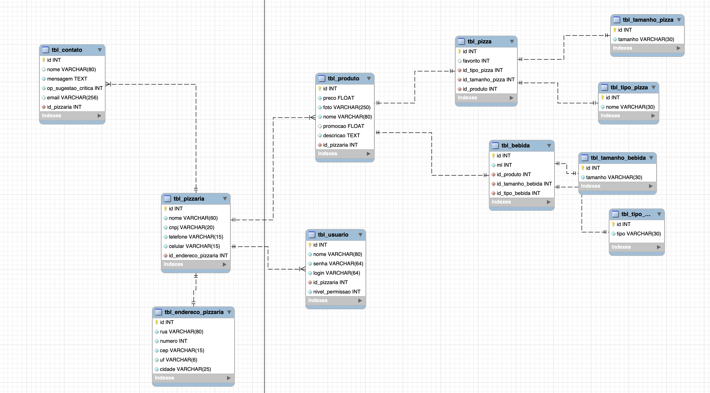

# Pizza Time

### Objetivo
Este projeto tem como objetivo fornecer um site dinamico para uma pizzaria, tendo com ele um banco de dados, o back-end e o front-end

### Tecnologias Utilizadas

 
  

           

### Link do Trello onde o projeto foi organizado 
 <a href="https://trello.com/invite/projetopizzatime/ATTI21cd4733a7226de98ec7cb1862423dc49C21E2B9"> Trello</a>

#

### Banco de Dados

   

#

### Back-end

O back-end foi realizado utilizando o nodeJS e o prisma (utilizado para linkar o Back com o Banco), e para o teste foi utilizado o App Postman

1. <a href="https://github.com/arthuraugusn/pizza-time-back-end">Back-End</a>

#

### Front-end

O site utilizou as linguagens de marcação HTML para estruturação e CSS para estilização, porém tambem foi utilizado O javaScript, para permitir interligar o Front-End com o Back-End, além disso foi utilizado para deixar a pagina mais dinámica 

1. <a href="https://www.figma.com/file/MXa6NKlw0thT81J3xqLMdn/Protótipo?node-id=0%3A1&t=Aa6FHLd6QHsenSbp-0"> Figma</a>
2. <a href="https://github.com/HeitorPontieri/pizza-frontend">Front-End</a>

